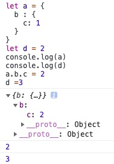
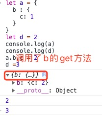

## 在JS中定义枚举的首选语法是什么
::: tip Object.freeze
Object.freeze() 方法可以冻结一个对象。一个被冻结的对象再也不能被修改；冻结了一个对象则不能向这个对象添加新的属性，不能删除已有属性，不能修改该对象已有属性的可枚举性、可配置性、可写性，以及不能修改已有属性的值。此外，冻结一个对象后该对象的原型也不能被修改。freeze() 返回和传入的参数相同的对象。
:::
我们平常都是用`const`来定义对象枚举，但是`const`对应的对象的值还是可以改动的，所以Object.freeze更适合枚举。
```js
const obj = {
  prop: 42
};

Object.freeze(obj);

obj.prop = 33;
// Throws an error in strict mode

console.log(obj.prop);
// expected output: 42
```
**Object.freeze并没有递归冻结对象。**
```js
let obj1 = {
  internal: {
    a:123
  }
};

Object.freeze(obj1);
obj1.internal.a = 'aValue';

obj1.internal.a // 'aValue'
```
## JS按位取反操作符~
### 预备知识
::: tip
计算机中没法做减法的，它的减法是通过加法来实现，需要加上一个负数，所以不得不引入一个符号位。
:::
### 原码
::: tip
是最简单的机器数表示法。用最高位表示符号位，‘1’表示负号，‘0’表示正号。其他位存放该数的二进制的绝对值。
:::
以带符号位的四位二进制值数为例：
::: tip
1010: 最高位为'1'，表示这是一个负数，其他三位'010'，即`（0*2^2）+（1*2^1）+（0*2^0）=2`（‘^’表示幂运算符）所以1010表示十进制数（-2）。
:::
下图给出部份正负数数的二进制原码表示法

既然都有正负数了，那么我们开始运算:
::: tip
0001+0010=0011    （1+2=3）
0000+1000=1000    （+0+（-0）=-0）
0001+1001=1010    （1+（-1）=-2）出现问题
:::
于是我们可以看到其实正数之间的加法通常是不会出错的，因为它就是一个很简单的二进制加法。

而正数与负数相加，或负数与负数相加，就要引起莫名其妙的结果，这都是该死的符号位引起的。0分为+0和-0也是因他而起。

所以原码，虽然直观易懂，易于正值转换。但用来实现加减法的话，运算规则总归是太复杂。于是反码来了。
### 反码
::: tip
我们知道，原码最大的问题就在于一个数加上他的相反数不等于零。
:::
例如：0001+1001=1010 (1+(-1)=-2) 0010+1010=1100 (2+(-2)=-4)
::: tip
反码：正数的反码还是等于原码<br>
负数的反码就是他的原码除符号位外，按位取反，例子：<br>
3是正数，反码与原码相同，则可以表示为0011<br>
-3的原码是1011，符号位保持不变，低三位（011）按位取反得（100）<br>
所以-3的反码为1100<br>
:::
那我们再试下，用反码的方式解决一下原码的问题：
::: tip
0001+1110=1111 （1+（-1）= - 0）

互为相反数相加等于0，解决。虽然是得到的结果是1111也就是-0，所以还不是很精确
:::
好，我们再试着做一下两个负数相加
::: tip
1110（-1）+ 1101（-2）= 1011（-4）
:::
-1 + (-2) = -4 ?
为了解决以上问题，补码就登场了。
### 补码
::: tip 补码定义
正数的补码等于他的原码

负数的补码等于反码+1
:::
在《计算机组成原理中》，补码的另外一种算法 是
::: tip
负数的补码等于他的原码自低位向高位，尾数的第一个‘1’及其右边的‘0’保持不变，左边的各位按位取反，符号位不变。

那正数的补码呢？加上一个正数，加法器就直接可以实现。所以它的补码就还是它本身。
:::
**补码实例**

现在来看几个例子:
::: tip 负数相加
1111（-1）+1110（-2）=1101(-3)
:::
::: tip 正负数相加
1000（-8） +0011（3）=1011(-5)

1110 (-2) + 0011(3) = 0001(1)
:::
### ~运算符
::: tip
作用于补码，将每一位二进制都取反:

~5: ~0101(5) => 1010(-6)
~-1: ~1111(-1) => 0000(0)
~0:~0000(0) => 1111(-1)
:::
经常被用到indexOf，如果是没有找到返回-1时，可以用`!~-1`表示`true`

## 模拟实现一个完美的Promise
::: tip
这里说的是模拟，所以用setTimeout来模拟，但是setTimeout是属于宏任务，原生的Promise是微任务。但是可以在调用上面最大程度模拟出来，模拟之前可以看看[PromiseA+规范](https://promisesaplus.com/)，当我写完代码后，又画出了实现Promise的流程图。
:::
### Promise/A+规范
::: tip
1. 'promise'是一个对象或者函数
2. 'thenable'是一个对象或者函数
3. 'value'是promise状态成功时的值
4. 'reason'是promise状态失败时的值
下面是：promise的属性，当然还有一些静态方法没有给出，比如：`Promise.resolve`、`Promise.race`、`Promise.all`等等
:::


### 要求
1. 一个promise必须有3个状态，pending，fulfilled(resolved)，rejected当处于pending状态的时候，可以转移到fulfilled(resolved)或者rejected状态。当处于fulfilled(resolved)状态或者rejected状态的时候，就不可变。
2. 一个promise必须有一个then方法，then方法接受两个参数：<br>
其中onFulfilled方法表示状态从pending——>fulfilled(resolved)时所执行的方法，而onRejected表示状态从pending——>rejected所执行的方法。<br>
`promise.then(onFulfilled,onRejected)`
3. 为了实现链式调用，then方法必须返回一个新的`Promise`，并且将上一个promise的状态传入到新的promise上，以便后面的链式调用，可以在then返回一个一个promise，`return new Promise()`，所以我们新建了一个`resolvePromise`函数来处理这块逻辑。
下面使用ES6的class完整的模拟的Promise
```js
class MyPromise {
  constructor(callback) {
    this.status = 'pending'
    this.value = undefined // status为resolved时返回的值
    this.reason = undefined // status为rejected时返回的值
    // 用来保存then传进来的函数，当状态改变时调用，声明成数组的原因是一个promise可能多处定义then或catch
    this.onFullfilledArray = []
    this.onRejectedArray = []
    try {
      // 由于resolve、reject都是在类外面执行的，所以需要绑定this
      callback(this.resolve.bind(this), this.reject.bind(this))
    } catch (error) {
      this.reject(error)
    }
  }

  /** 传入两个promise，将第二个的promise的value或者reason转移到currentPromise
 * @callback resolve
 * @callback reject
 * @param {Promise} currentPromise 当前promise对象
 * @param {*} x 当前resolve或者reject之后的结果
 * @param {resolve} resolve 当前promise对象的resolve
 * @param {reject} reject 当前promise对象的reject
 */
  static resolvePromise(currentPromise, x, resolve, reject) {
    if (currentPromise === x) {
      reject(new TypeError('Chaining cycle'));
    }
    // 如果结果x存在且是对象或者是一个函数
    if (x && typeof x === 'object' || typeof x === 'function') {
      let used; // then(cb1,cb2)cb1,cb2两者只能调用其中一个
      try {
        let then = x.then;
        // 如果返回值x有then函数，则
        if (typeof then === 'function') {
          then.call(x, (y) => {
            if (used) return;
            used = true;
            MyPromise.resolvePromise(currentPromise, y, resolve, reject);
          }, (r) => {
            if (used) return;
            used = true;
            reject(r);
          });
        } else {
          if (used) return;
          used = true;
          resolve(x);
        }
      } catch (e) {
        if (used) return;
        used = true;
        reject(e);
      }
    } else {
      resolve(x);
    }
  }

  reject(error) {
    if (this.status === 'pending') {
      this.status = 'rejected'
      this.reason = error
      this.onRejectedArray.forEach(f => {
        // 执行then传的函数
        f(error)
      })
    }
    // console.log('reject', error)
  }

  resolve(value) {
    if (this.status === 'pending') {
      this.status = 'resolved'
      this.value = value
      this.onFullfilledArray.forEach(f => {
        // 执行then传的函数
        f(value)
      })
    }
    // console.log('resolved', value)
  }

  // then函数可以传一个或两个函数
  then(onFullfilled, onRejected) {
    onFullfilled = typeof onFullfilled === 'function' ? onFullfilled : value => value;
    onRejected = typeof onRejected === 'function' ? onRejected : err => { throw err };
    let tempPromise,
      self = this
    switch (this.status) {
      case 'pending':
        tempPromise = new MyPromise((resolve, reject) => {
          // 保存.then传的第一个函数
          self.onFullfilledArray.push(function (value) {
            setTimeout(() => {
              try {
                let x = onFullfilled(value)
                MyPromise.resolvePromise(tempPromise, x, resolve, reject)
              } catch (error) {
                reject(error)
              }
            })
          })
          // 保存.then传的第二个函数
            self.onRejectedArray.push(function (reason) {
              setTimeout(() => {
                try {
                    let x = onRejected(reason)
                    MyPromise.resolvePromise(tempPromise, x, resolve, reject)
                } catch (error) {
                  reject(error)
                }
              })
            })
        })
        break;
      case 'resolved':
        tempPromise = new MyPromise((resolve, reject) => {
          setTimeout(() => {
            try {
                let x = onFullfilled(self.value)
                MyPromise.resolvePromise(tempPromise, x, resolve, reject)
            } catch (error) {
              reject(error)
            }
          })
        })
        break;
      case 'rejected':
        tempPromise = new MyPromise((resolve, reject) => {
          setTimeout(() => {
            try {
              if (onRejected) {
                let x = onRejected(self.reason)
                MyPromise.resolvePromise(tempPromise, x, resolve, reject)
              }
            } catch (error) {
              reject(error)
            }
          });
        })
        break;
    }
    return tempPromise
  }
  catch(onRejected) {
    return this.then(null, onRejected);
  }
}
```
为了更好的理解这段代码，画出了一个流程图:

## 继承的几种方式
```js
function Father(name) {
  // 属性
  this.name = name || 'father',
    // 实例方法
    this.sleep = function () {
      console.log(this.name + "正在睡觉");
    }
}
// 原型方法
Father.prototype.look = function (book) {
  console.log(this.name + "正在看:" + book);
}
```
### 原型继承
父类中私有的和公有的都继承到了子类原型上
```js
function Son(){}
Son.prototype = new Father() // 重写了Son的原型
Son.prototype.constructor = Son
```
### 构造继承
只是将Father的私有属性拷贝一份给Son，并没有将原型链指向Father
```js
function Son() {
  Father.call(this)
}
```
### 混合模式
有点弊端，会实例化两次Father，而且Father的私有属性也会在Son的原型上
```js
function Son() {
  Father.call(this)
}
Son.prototype = new Father()
Son.prototype.constructor = Son
```

### 寄生组合模式
解决了混合模式的弊端
```js
function Son() {
  Father.call(this)
}
// Object.create的Polyfill
function myCreate(proto) {
  function fn() {}
  fn.prototype = proto
  return fn
}
Son.prototype = myCreate(Father.prototype)
Son.constructor = Son
```
::: tip 注意
 如果将`Son.prototype = myCreate(Father.prototype)`改成`Son.prototype = Father.prototype`，虽然还是继承了，但是Father的原型和Son的原型是同一个引用地址，所以改动Son.prototype时就会将Father一起改动。
:::
### ES6中extends的实现
```js
function Son() {
  Father.call(this)
}
Son.prototype = Object.create(Father.prototype,
  { constructor: { value: Son, writable: true, configurable: true } });
Son.__proto__ = Father
```

## js中new一个对象的过程
::: tip
new Funtion()

首先了解new做了什么，使用new关键字调用函数（new ClassA(…)）的具体步骤：
::: tip MDN原文
1. Creates a blank, plain JavaScript object;
2. Links (sets the constructor of) this object to another object;
3. Passes the newly created object from Step 1 as the this context;
4. Returns this if the function doesn't return its own object.
:::
1. 创建一个空白的纯js对象：var obj = {}
2. 设置`obj`的构造器指向`Funtion`（函数本身就是构造器），设置新对象的__proto__属性指向构造函数的prototype对象；obj.__proto__ = ClassA.prototype
3. 使用新对象调用函数，函数中的this被指向新实例对象: ClassA.call(obj);
4. 将初始化完毕的新对象，保存到等号右边的变量中。
:::
通过上面的解释，我们发现凡是拥有构造器的都可以实例化，看下面的例子：
```js
let a = {}
// a的构造器
a.constructor // ƒ Object() { [native code] }
let b = new a() // Uncaught TypeError: a is not a constructor
```
`a`的构造器是指向`Object()`函数，不是它自己的，所以不能实例化，所以我们只能这样`let c = Object()`。

`class`也有自己的构造器所以也可以实例化，其他的都没办法实例化
## for与forEach的区别
::: tip
for循环每一次遍历都会重新检查跳出的条件，比如数组的长度，但是forEach只会保存第一次的数组长度。
:::
```js
let arr = [1,2,3]

arr.forEach(item => {
  if(item === 2) {
    arr.push(4)
  }
  console.log(item)
})
// 输出： 1 2 3

for (let i = 0; i < arr.length; i++) {
  if (arr[i] === 2){
    arr.push(4)
  }
  console.log(arr[i])
}
// 输出：1 2 3 4
```

## 装饰器的原理
::: tip 分类
装饰器分为两类：作用于类的装饰器、作用于方法的装饰器，底层都是函数。
:::
* 作用于类的装饰器，写法举例
```js
function log (target) {  // 默认传参为 被修饰的类
    target.prototype.logger = () => {console.log('装饰器--被调用')};
}

@log       // log 必须是函数
class Myclass {};

const test = new Myclass();
test.logger();          // 装饰器--被调用
```

* 作用于方法的装饰器，写法举例
```js
Object.defineProperty(obj, prop, descriptor);
class C {
   @readonly (true);
   method () {
      console.log('cat');
   }
}

function readonly (value) {
   // target: 类原型
   // key:    被修饰的属性或者方法
   // descriptor: 被修饰的属性或方法的描述符对象
   return function (target, key, descriptor) {
      descriptor.writable = !value;
      return descriptor;
   }
}

const c = new C();
c.method = () => {console.log('dog');} // 重写了method这个类方法
c.method() // cat  => 设置属性只读成功
```

## eval&&Function
::: tip eval
eval可以取到上下文，但是在ES5后有个硬性规定：通过一个引用来调用它，而不是直接的调用 eval。 从 ECMAScript 5 起，它工作在全局作用域下，而不是局部作用域中。这就意味着，例如，下面的代码的作用声明创建一个全局函数，并且 eval 中的这些代码在执行期间不能在被调用的作用域中访问局部变量
```js
function test() {
  var x = 2, y = 4;
  console.log(eval('x + y'));  // 直接调用，使用本地作用域，结果是 6
  var geval = eval; // 等价于在全局作用域调用
  console.log(geval('x + y')); // 间接调用，使用全局作用域，throws ReferenceError 因为`x`未定义
  (0, eval)('x + y'); // 另一个间接调用的例子
​}
```
:::

::: tip Function
与eval不同的是它可以入参，还有不同的就是作用域总是指向全局作用域。
:::

MDN原文：

Functions created with the Function constructor do not create closures to their creation contexts; they always are created in the global scope. When running them, they will only be able to access their own local variables and global ones, not the ones from the scope in which the Function constructor was created. This is different from using eval with code for a function expression.

翻译：

使用函数构造函数创建的函数不会对其创建上下文创建闭包;它们总是在全局范围内创建的。在运行它们时，它们只能访问自己的局部变量和全局变量，而不能访问创建函数构造函数的作用域中的变量。这不同于对函数表达式的代码使用eval。

```js
var x = 10;

function createFunction1() {
    var x = 20;
    return new Function('return x;'); // 这里的 x 指向最上面全局作用域内的 x
}

function createFunction2() {
    var x = 20;
    function f() {
        return x; // 这里的 x 指向上方本地作用域内的 x
    }
    return f;
}

var f1 = createFunction1();
console.log(f1());          // 10
var f2 = createFunction2();
console.log(f2());          // 20
```

## Map && WeakMap
::: tip WeakMap存在的意义
WeakMap的专用场合就是防止内存泄漏，它的键所对应的对象，可能会在将来消失，WeakMap就会自动清除这个引用，而不是额外保留一份。
:::
### Map
让我们先理解Map的基本用法：
```js
let obj = { test: 2 } // obj对象引用的计数是1
let map = new Map()
map.set(obj, '66') // obj对象引用的计数是2
console.log(obj) // { test: 2 }
console.log(map.get(obj))  // '66'
obj.one = 1
// 由于对应的是引用地址，所以还是可以取的到
console.log(obj) // { test: 2, one: 1 }
console.log(map.get(obj))  // '66'
obj = { test: 2, one: 1 }
console.log(map.get(obj))  // 'null'
obj = null // obj对象引用的计数是1
console.log(map) // Map { { test: 2, one: 1 } => '66' }
```
从上面的例子可以看出，不管`obj`里面的值怎么变，都可以拿到对应的值，除非是赋值然后引用地址变了，才取不到`map`的值。最后将`obj`置为`null`，`obj`对象引用的计数变为1，还是不会被垃圾回收机制回收。
### WeakMap
```js
let obj = { test: 2 } // obj对象引用的计数是1
let map = new WeakMap() // obj对象引用的计数是1
map.set(obj, '66')
console.log(map.get(obj))  // 'null'
obj = null // obj对象引用的计数是0 随时会被垃圾回收，其实map里面也没有了这个键值对
console.log(map) // WeakMap { [items unknown] }
```
WeakMap经常在保存节点时有用，请看下面例子：
```js
const wm = new WeakMap();
const element = document.getElementById('example');
wm.set(element, 'some information');
wm.get(element) // "some information"
```
上面代码中，先新建一个 `Weakmap` 实例。然后，将一个 DOM 节点作为键名存入该实例，并将一些附加信息作为键值，一起存放在 `WeakMap` 里面。这时，`WeakMap` 里面对`element`的引用就是弱引用，不会被计入垃圾回收机制。

也就是说，上面的 `DOM` 节点对象的引用计数是`1`，而不是`2`。这时，一旦消除对该节点的引用，它占用的内存就会被垃圾回收机制释放。`Weakmap` 保存的这个键值对，也会自动消失。

## 说说从输入URL到页面呈现发生了什么？
**在浏览器输入了`https://www.baidu.com`**
1. 构建请求
浏览器会构建请求行:

GET / HTTP/1.1
2. 查找强缓存
先检查强缓存，如果命中直接使用，否则进入下一步。
3. DNS解析
数据包是通过IP地址传给对方的，但是我们输入的是域名，所以需要去域名系统(DNS)找到与当前域名对应的IP地址，找到具体的IP地址的这个过程就是DNS解析。

当然，值得注意的是浏览器提供了DNS数据缓存功能。即如果一个域名已经解析过，就会把解析的结果缓存下来，下次处理直接走缓存，不需要走DNS解析。
4. 建立TCP（Transmission Control Protocol传输控制协议）连接
建立TCP连接经历了下面三个阶段：
* 通过`三次握手`建立客户端和服务器之间的连接
* 进行数据传输。这里有个重要的机制，就是接受方接收到数据包后必须要向发生方`确认`，如果发送方没有接到这个`确认`消息，就判定为数据丢失，并重新发送该数据包。当然，发送的过程中还有一个优化策略，就是把`大的数据包拆成一个个小包`，依次传输到接收方，接收方按照这个小包的顺序把它们`组装`成完整数据包
* 断开连接的阶段。数据传输完成，现在要端开连接了，通过`四次握手`来断开连接。
5. 发送HTTP请求
现在TCP连接建立完毕，浏览器可以和服务器开始通信，即开始发送HTTP请求，浏览器发送HTTP请求要携带三样东西：请求行、请求头和请求体
请求行类似下面这样:
```js
// 请求方法:GET，路径:/list HTTP协议版本:1.1
`GET /list HTTP/1.1`
```
**网络响应**
HTTP到达服务器后，服务器进行对应的处理。最终把数据回传给浏览器，就是返回网络响应。

跟请求部分类似，网络响应具有三个部分：响应行、响应头和响应体。

响应行类似下面这样：
```js
// HTTP版本:1.1 状态码:200 状态描述:OK
`HTTP/1.1 200 OK`
```
响应完成之后怎么办？TC连接就断开了吗？

不一定。这时候要判断`Connection`字段，如果请求头或响应中包含`Connection: Keep-Alive`，表示建立了持久连接，这样TCP连接会一直保持，之后请求统一站点的资源会复用这个连接。

否则断开TCP连接, 请求-响应流程结束。

### 算法篇
::: tip  Content-Type:text/html
完成了网络请求和响应，如果响应头中Content-Type的值是text/html，那么接下来就是浏览器的解析和渲染工作了。
:::
首先来介绍解析部分，主要分为以下几个步骤：
* 构建`dom`树
* 样式计算
* 生成布局树(layout tree)

构建dom树

由于浏览器无法直接理解`html字符串`，因此将这一系列的字节流转换为一种有意义并且方便操作的数据结构，这种数据结构就是dom树。dom树本质上一个以`document`为根节点的多叉树。

HTML文法的本质

## V8执行一段JS代码的过程
::: tip
首先明白的是，机器是读不懂JS代码，机器只能理解特定的机器码，那如果要让JS的逻辑在机器运行起来，就必须将JS的代码翻译成机器码，然后让机器识别。JS属于解释新型语言，对于解释型的语言说，解释器会对源码做如下分析：

* 通过词法分析和语法分析生成AST(抽象语法树)
* 生成字节码
:::

1. 生成AST
生成AST分为两步--词法分析和语法分析

## 栅格化布局
利用flex可以实现

## import && require
::: import
编译时调用，就会生成一个只读引用。等到脚本真正执行时，再根据这个只读引用，到被加载的那个模块里面去取值。由于是在编译时调用，所以`webpack`可以通过`import`的特性来产生依赖图谱。
```js
// lib.js
var counter = 3;
function incCounter() {
  counter++;
}
module.exports = {
  counter: counter,
  incCounter: incCounter,
};

// main.js
var mod = require('./lib');

console.log(mod.counter);  // 3
mod.incCounter();
console.log(mod.counter); // 4
```
:::

::: require
运行时调用，输出的是一个值的拷贝，一旦输出一个值，模块内部的变化就影响不到这个值。
```js
// lib.js
var counter = 3;
function incCounter() {
  counter++;
}
module.exports = {
  counter: counter,
  incCounter: incCounter,
};

// main.js
var mod = require('./lib');

console.log(mod.counter);  // 3
mod.incCounter();
console.log(mod.counter); // 3
```
:::

## 多使用位运算提高代码效率
::: tip JS代码编译步骤
1： js代码 经历 词法分析，成为token
2： 然后经过语法分析，将token转换成AST(抽象语法树)
3： 用解释器根据AST，生成字节码
4： 使用JIT即时编译技术，将字节码转成机器码，然后计算机就可以识别执行了。
:::
所以我们使用判断奇偶数的时候用`8 & 1`或`8 % 2`就有区别了，机器码其实就是二进制，所以`8 & 1`只需要运算`1000 & 0001`，而`8 % 2`中%需要转成机器码能识别的运算符，所以位运算就会快一点。


## console.log是异步还是同步
我们先看下面得例子：
```js
let a = {
  b : {
    c: 1
  }
}
console.log(a)
a.b.c = 2
```

咋一看好像是异步的，但是为什么数字就是同步的呢？其实里面有个坑，我们都知道对象是引用类型，所以`console.log`打印引用类型的时候是打印指针指向的引用地址的内容，我们手动展开的时候其实是调用了当前对象的`get`方法，这是才去读取改引用地址里面的内容，导致一些人说console.log是异步。


### node环境下的console.log
::: tip node下的console.log
我们首先要知道Node.js中实现console.log的原理
function log() { process.stdout.write( util.format.apply(this, arguments); )}
等同于问process.stdout.write是同步还是异步的？
其实官方文档已经给出了答案,A note on process I/O
process.stdout和process.stderr是根据系统环境来判定的同步还是异步的
Files: synchronous on Windows and Linux
TTYs (Terminals): asynchronous on Windows, synchronous on Unix
Pipes (and sockets): synchronous on Windows, asynchronous on Unix
那么console.log也是根据系统环境来判定同步还是异步的。
:::


## 在请求帧动画中会经常操作dom节点，操作dom需要时间，怎么优化


## 如何在 Array.forEach 中正确使用 Async
```js
const arr = [1, 2, 3]

const sleep = (delay, v) => {
  return new Promise((resolve, reject) => {
    setTimeout(() => {
      resolve(1)
    }, delay)
  })
}

arr.forEach(async (v, i) => {
  await sleep(1000 - (i * 100), i)
  console.log(v)
})
// 输出：
// 3
// 2
// 1
```
 上面输出3、2、1，说明await是没有生效的，看了forEach的Polyfill就知道，是在一个while循环里面执行的，相当于上面是三个函数一起执行，我们想要的效果是第一个函数执行完再执行第二个函数，我们可以用reduce
 ```js
 const arr = [1, 2, 3]

const sleep = (delay, v) => {
  return new Promise((resolve, reject) => {
    setTimeout(() => {
      resolve(1)
    }, delay)
  })
}
arr.reduce(async (initial, v, i) => {
  // 因为此时的initial是上一个函数的返回值，如果没有promise没有执行完，会在await的关键字下停顿
  await initial
  await sleep(1000 - (i * 100), i)
  console.log(v)
}, 0)
// 输出：
// 1
// 2
// 3
 ```
 我们可以看到reduce的Polyfill:
 ```js
 if (!Array.prototype.reduce) {
  Object.defineProperty(Array.prototype, 'reduce', {
    value: function (callback /*, initialValue */) {
      // ...more
      while (k < len) {
        if (k in o) {
          value = callback(value, o[k], k, o)
        }
        k++
      }
      return value
    }
  })
}
 ```
 可以看到value就是`initial`，从`value = callback(value, o[k], k, o)`可以看出来initial保存这上一个函数的返回值，由于我们用了`aysnc`所以会返回一个`promise`对象，然后用`await initial`后可以在当前函数停顿。
<!-- ../../../.vuepress/public/line-height.png) -->
图片 

