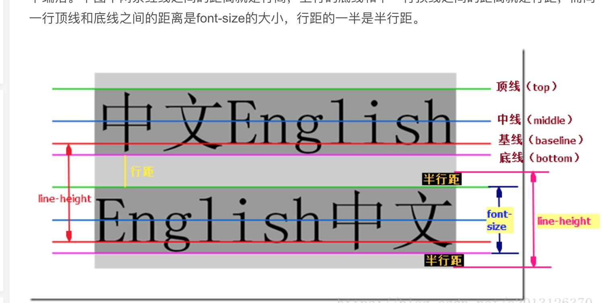

::: tip 概述
。。。
:::
## css reset
1. reset 的目的不是清除浏览器的默认样式，这仅是部分工作。清除和重置是紧密不可分的。
2. reset 的目的不是让默认样式在所有浏览器下一致，而是减少默认样式有可能带来的问题。
3. reset 期望提供一套普适通用的基础样式。但没有银弹，推荐根据具体需求，裁剪和修改后再使用。
::: tip 引发的问题
1. *{}会带来性能问题
2. 使用通配符存在隐性问题
:::
::: tip
这里推荐一个轻量级的css reset方案：normalize.css，它可以在元素样式上提供了跨浏览器的高度一致性。
:::
## BFC（Block Formatting Context)
::: tip
一个创建了新的BFC的盒子是独立布局的，盒子里面的子元素的样式不会影响到外面的元素。BFC是Web页面中盒模型布局的一种CSS渲染模式。它的定位体系属于 常规文档流。
:::
如何创建BFC：
- 根元素
- 浮动元素
- 绝对定位元素
- display取值为inline-block，table-cell，table-caption,flex, inline-flex之一的元素
- overflow不是visible的元素
作用
> 可以包含浮动元素
>
> > 不被浮动元素覆盖
> >
> > > 阻止父子元素的margin折叠
## line-height
::: tip 基本概念
行高是指文本行基线间的垂直距离。基线并不是汉字文字的下端沿，而是英文字母“x”的下端沿（就像英文本子的是四条线，“x”的底部）。
:::
两条红线之间的距离就是行高，上行的底线和下一行顶线之间的距离就是行距，而同一行顶线和底线之间的距离是font-size的大小，行距的一半是半行距。

从上图我们就可以看出，行距、font-size与line-height之间的关系：行距 = font-size - line-height

