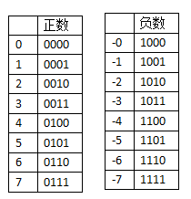
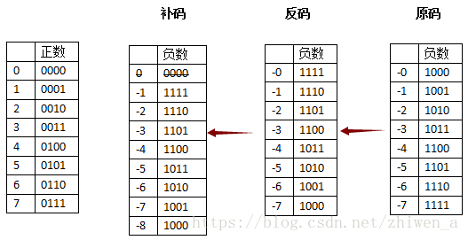

::: tip 概述
:::

## 在JS中定义枚举的首选语法是什么
::: tip Object.freeze
Object.freeze() 方法可以冻结一个对象。一个被冻结的对象再也不能被修改；冻结了一个对象则不能向这个对象添加新的属性，不能删除已有属性，不能修改该对象已有属性的可枚举性、可配置性、可写性，以及不能修改已有属性的值。此外，冻结一个对象后该对象的原型也不能被修改。freeze() 返回和传入的参数相同的对象。
:::
我们平常都是用`const`来定义对象枚举，但是`const`对应的对象的值还是可以改动的，所以Object.freeze更适合枚举。
```js
const obj = {
  prop: 42
};

Object.freeze(obj);

obj.prop = 33;
// Throws an error in strict mode

console.log(obj.prop);
// expected output: 42
```
**Object.freeze并没有递归冻结对象。**
```js
let obj1 = {
  internal: {
    a:123
  }
};

Object.freeze(obj1);
obj1.internal.a = 'aValue';

obj1.internal.a // 'aValue'
```
## JS按位取反操作符~
### 预备知识
::: tip
计算机中没法做减法的，它的减法是通过加法来实现，需要加上一个负数，所以不得不引入一个符号位。
:::
### 原码
::: tip
是最简单的机器数表示法。用最高位表示符号位，‘1’表示负号，‘0’表示正号。其他位存放该数的二进制的绝对值。
:::
以带符号位的四位二进制值数为例：
::: tip
1010: 最高位为'1'，表示这是一个负数，其他三位'010'，即`（0*2^2）+（1*2^1）+（0*2^0）=2`（‘^’表示幂运算符）所以1010表示十进制数（-2）。
:::
下图给出部份正负数数的二进制原码表示法

既然都有正负数了，那么我们开始运算:
::: tip
0001+0010=0011    （1+2=3）
0000+1000=1000    （+0+（-0）=-0）
0001+1001=1010    （1+（-1）=-2）出现问题
:::
于是我们可以看到其实正数之间的加法通常是不会出错的，因为它就是一个很简单的二进制加法。

而正数与负数相加，或负数与负数相加，就要引起莫名其妙的结果，这都是该死的符号位引起的。0分为+0和-0也是因他而起。

所以原码，虽然直观易懂，易于正值转换。但用来实现加减法的话，运算规则总归是太复杂。于是反码来了。
### 反码
::: tip
我们知道，原码最大的问题就在于一个数加上他的相反数不等于零。
:::
例如：0001+1001=1010 (1+(-1)=-2) 0010+1010=1100 (2+(-2)=-4)
::: tip
反码：正数的反码还是等于原码<br>
负数的反码就是他的原码除符号位外，按位取反，例子：<br>
3是正数，反码与原码相同，则可以表示为0011<br>
-3的原码是1011，符号位保持不变，低三位（011）按位取反得（100）<br>
所以-3的反码为1100<br>
:::
那我们再试下，用反码的方式解决一下原码的问题：
::: tip
0001+1110=1111 （1+（-1）= - 0）

互为相反数相加等于0，解决。虽然是得到的结果是1111也就是-0，所以还不是很精确
:::
好，我们再试着做一下两个负数相加
::: tip
1110（-1）+ 1101（-2）= 1011（-4）
:::
-1 + (-2) = -4 ?
为了解决以上问题，补码就登场了。
### 补码
::: tip 补码定义
正数的补码等于他的原码

负数的补码等于反码+1
:::
在《计算机组成原理中》，补码的另外一种算法 是
::: tip
负数的补码等于他的原码自低位向高位，尾数的第一个‘1’及其右边的‘0’保持不变，左边的各位按位取反，符号位不变。

那正数的补码呢？加上一个正数，加法器就直接可以实现。所以它的补码就还是它本身。
:::
**补码实例**

现在来看几个例子:
::: tip 负数相加
1111（-1）+1110（-2）=1101(-3)
:::
::: tip 正负数相加
1000（-8） +0011（3）=1011(-5)

1110 (-2) + 0011(3) = 0001(1)
:::
### ~运算符
::: tip
作用于补码，将每一位二进制都取反:

~5: ~0101(5) => 1010(-6)
~-1: ~1111(-1) => 0000(0)
~0:~0000(0) => 1111(-1)
:::
经常被用到indexOf，如果是没有找到返回-1时，可以用`!~-1`表示`true`

## 实现一个完美的Promise
### Promise/A+规范
::: tip
1. 'promise'是一个对象或者函数
2. 'thenable'是一个对象或者函数
3. 'value'是promise状态成功时的值
4. 'reason'是promise状态失败时的值
:::
### 要求
1. 一个promise必须有3个状态，pending，fulfilled(resolved)，rejected当处于pending状态的时候，可以转移到fulfilled(resolved)或者rejected状态。当处于fulfilled(resolved)状态或者rejected状态的时候，就不可变。
2. 一个promise必须有一个then方法，then方法接受两个参数：<br>
其中onFulfilled方法表示状态从pending——>fulfilled(resolved)时所执行的方法，而onRejected表示状态从pending——>rejected所执行的方法。<br>
`promise.then(onFulfilled,onRejected)`
3. 为了实现链式调用，then方法必须返回一个promise
`promise2=promise1.then(onFulfilled,onRejected)`

下面使用ES6的class写了有个初版的Promise
```js
class MyPromise{
  constructor(callback){
    this.status = 'pending'
    this.value = undefined // status为resolved时返回的值
    this.reason = undefined // status为rejected时返回的值
    // 用来保存then传进来的函数，当状态改变时调用
    this.onFullfilledArray = []
    this.onRejectedArray = []
    try {
      // 由于resolve、reject都是在类外面执行的，所以需要绑定this
      callback(this.resolve.bind(this), this.reject.bind(this))
    } catch (error) {
      this.reject(error)
    }
  }

  //
  reject(error) {
    if (this.status === 'pending') {
      this.status = 'rejected'
      this.reason = error
      this.onRejectedArray.forEach(f => {
        // 执行then传的函数
        f(error)
      })
    }
    console.log('reject', error)
  }

  resolve(value) {
    if (this.status === 'pending') {
      this.status = 'resolved'
      this.value = value
      this.onFullfilledArray.forEach(f => {
        // 执行then传的函数
        f(value)
      })
    }
    console.log('resolved', value)
  }

  // then函数可以传一个或两个函数
  then(onFullfilled, onRejected) {
    let tempPromise,
        self = this
    switch(this.status) {
      case 'pending':
        tempPromise = new MyPromise((resolve, reject) => {
          self.onFullfilledArray.push(function (value) {
            try {
            let temp = onFullfilled(value)
              resolve(temp)
            } catch (error) {
              reject(error)
            }
          });
          self.onRejectedArray.push(function (reason) {
            try {
              let temp = onRejected(reason)
              reject(temp)
            } catch (error) {
              reject(error)
            }
          });
        })
        break;
      case 'resolved':
        tempPromise = new MyPromise((resolve, reject) => {
          try {
            let temp = onFullfilled(self.value)
            resolve(temp)
          } catch (error) {
            reject(error)
          }
        })
        break;
      case 'rejected':
        tempPromise = new MyPromise((resolve, reject) => {
          try {
            let temp = onRejected(self.reason)
            reject(temp)
          } catch (error) {
            reject(error)
          }
        })

        break;
    }
    return tempPromise
  }
}


let myPromise = new MyPromise((resolve, reject) => {
  console.log('请求数据...')
  setTimeout(() => {
    resolve(1)
  }, 1000);
})
myPromise.then(res => {
  console.log('第一个then:',res)
  return 2
}).then(res => {
  console.log('第二个then:', res)
  return 3
})

// 输出结果：
// 请求数据...
// 第一个then: 1
// 第二个then: 2
// resolved 3
// resolved 2
// resolved 1
```
但是上面还有一个缺点，就是不能在then中return


## js中new一个对象的过程
::: tip
首先了解new做了什么，使用new关键字调用函数（new ClassA(…)）的具体步骤：
::: tip MDN原文
1. Creates a blank, plain JavaScript object;
2. Links (sets the constructor of) this object to another object;
3. Passes the newly created object from Step 1 as the this context;
4. Returns this if the function doesn't return its own object.
:::
1. 创建一个空白的纯js对象：var obj = {}
2. 设置当前空对象的constructor指向另一个对象，设置新对象的__proto__属性指向构造函数的prototype对象；obj.__proto__ = ClassA.prototype
3. 使用新对象调用函数，函数中的this被指向新实例对象: ClassA.call(obj);
4. 将初始化完毕的新对象，保存到等号右边的变量中。
:::

## for与forEach的区别
```js
let arr = [1,2,3]

arr.forEach(item => {
  if(item === 2) {
    arr.push(4)
  }
  console.log(item)
})
// 输出： 1 2 3

for (let i = 0; i < arr.length; i++) {
  if (arr[i] === 2){
    arr.push(4)
  }
  console.log(arr[i])
}
// 输出：1 2 3 4
```

## 装饰器的原理
::: tip 分类
装饰器分为两类：作用于类的装饰器、作用于方法的装饰器，底层都是函数。
:::
* 作用于类的装饰器，写法举例
```js
function log (target) {  // 默认传参为 被修饰的类
    target.prototype.logger = () => {console.log('装饰器--被调用')};
}

@log       // log 必须是函数
class Myclass {};

const test = new Myclass();
test.logger();          // 装饰器--被调用
```

* 作用于方法的装饰器，写法举例
```js
Object.defineProperty(obj, prop, descriptor);
class C {
   @readonly (true);
   method () {
      console.log('cat');
   }
}

function readonly (value) {
   // target: 类原型
   // key:    被修饰的属性或者方法
   // descriptor: 被修饰的属性或方法的描述符对象
   return function (target, key, descriptor) {
      descriptor.writable = !value;
      return descriptor;
   }
}

const c = new C();
c.method = () => {console.log('dog');} // 重写了method这个类方法
c.method() // cat  => 设置属性只读成功
```

## eval&&Function
::: tip eval
eval可以取到上下文，但是在ES5后有个硬性规定：通过一个引用来调用它，而不是直接的调用 eval。 从 ECMAScript 5 起，它工作在全局作用域下，而不是局部作用域中。这就意味着，例如，下面的代码的作用声明创建一个全局函数，并且 eval 中的这些代码在执行期间不能在被调用的作用域中访问局部变量
```js
function test() {
  var x = 2, y = 4;
  console.log(eval('x + y'));  // 直接调用，使用本地作用域，结果是 6
  var geval = eval; // 等价于在全局作用域调用
  console.log(geval('x + y')); // 间接调用，使用全局作用域，throws ReferenceError 因为`x`未定义
  (0, eval)('x + y'); // 另一个间接调用的例子
​}
```
:::

::: tip Function
与eval不同的是它可以入参，还有不同的就是作用域总是指向全局作用域。
:::

MDN原文：

Functions created with the Function constructor do not create closures to their creation contexts; they always are created in the global scope. When running them, they will only be able to access their own local variables and global ones, not the ones from the scope in which the Function constructor was created. This is different from using eval with code for a function expression.

翻译：

使用函数构造函数创建的函数不会对其创建上下文创建闭包;它们总是在全局范围内创建的。在运行它们时，它们只能访问自己的局部变量和全局变量，而不能访问创建函数构造函数的作用域中的变量。这不同于对函数表达式的代码使用eval。

```js
var x = 10;

function createFunction1() {
    var x = 20;
    return new Function('return x;'); // 这里的 x 指向最上面全局作用域内的 x
}

function createFunction2() {
    var x = 20;
    function f() {
        return x; // 这里的 x 指向上方本地作用域内的 x
    }
    return f;
}

var f1 = createFunction1();
console.log(f1());          // 10
var f2 = createFunction2();
console.log(f2());          // 20
```

## Map && WeakMap
::: tip WeakMap存在的意义
WeakMap的专用场合就是防止内存泄漏，它的键所对应的对象，可能会在将来消失，WeakMap就会自动清除这个引用，而不是额外保留一份。
:::
### Map
让我们先理解Map的基本用法：
```js
let obj = { test: 2 } // obj对象引用的计数是1
let map = new Map()
map.set(obj, '66') // obj对象引用的计数是2
console.log(obj) // { test: 2 }
console.log(map.get(obj))  // '66'
obj.one = 1
// 由于对应的是引用地址，所以还是可以取的到
console.log(obj) // { test: 2, one: 1 }
console.log(map.get(obj))  // '66'
obj = { test: 2, one: 1 }
console.log(map.get(obj))  // 'null'
obj = null // obj对象引用的计数是1
console.log(map) // Map { { test: 2, one: 1 } => '66' }
```
从上面的例子可以看出，不管`obj`里面的值怎么变，都可以拿到对应的值，除非是赋值然后引用地址变了，才取不到`map`的值。最后将obj置为null，obj对象引用的计数变为1，还是不会被垃圾回收机制回收。
### WeakMap
```js
let obj = { test: 2 } // obj对象引用的计数是1
let map = new WeakMap() // obj对象引用的计数是1
map.set(obj, '66')
console.log(map.get(obj))  // 'null'
obj = null // obj对象引用的计数是0 随时会被垃圾回收
console.log(map) // WeakMap { [items unknown] }
```


超链接 [文本](URL)
<!-- ../../.vuepress/public/line-height.png) -->
图片 

