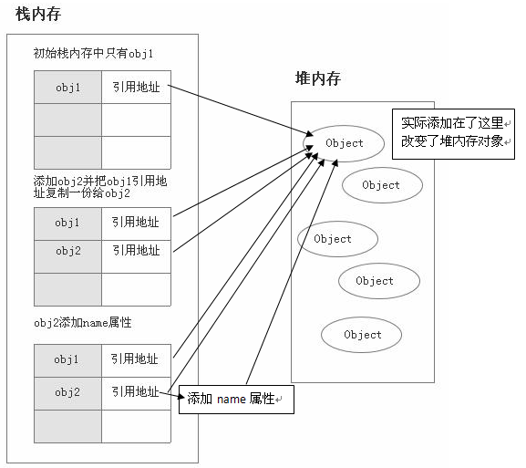

## js中for in与for of之间的差异

let aArray = ['a',123,{a:1,b:2}]

```
for(let index in aArray){
    console.log(index);
}
```

输出: 0 1 2 说明遍历的是index，

## 扩展运算符...

::: tip 对扩展运算符的理解
对象中的扩展运算符(...)用于取出参数对象中的所有可遍历属性，拷贝到当前对象之中
:::

``` js
let bar = { a: 1, b: 2 };
let baz = { ...bar }; // { a: 1, b: 2 }
```
上面的方法实际上就等于
``` js
let bar = { a: 1, b: 2 };
let baz = Object.assign({}, bar); // { a: 1, b: 2 }
```
Object.assign方法的第一个参数是目标对象，后面的参数都是源对象。(如果目标对象与源对象有同名属性，或多个源对象有同名属性，则后面的属性会覆盖前面的属性)。<br>
同样，如果用户自定义的属性，放在扩展运算符后面，则扩展运算符内部的同名属性会被覆盖掉。
```js
let bar = {a: 1, b: 2};
let baz = {...bar, ...{a:2, b: 4}};  // {a: 2, b: 4}
baz.a = 10
console.log(bar) // {a: 1, b: 2};
console.log(baz) // {a: 10, b: 2};
```
### ...是浅拷贝
我们看个例子
```js
let bar = {a: 1, b: {one:1,two: 2}};
let baz = {...bar};
console.log(bar) // { a: 1, b: { one: 1, two: 2 } }
baz.b.one = 10
console.log('baz',baz) // baz { a: 1, b: { one: 10, two: 2 } }
console.log('bar',bar) // bar { a: 1, b: { one: 10, two: 2 } }
```
::: tip 基础数据类型与引用类型
javascript中有两种数据类型，分别是基础数据类型和引用数据类型。基础数据类型是按值访问的，常见的基础数据类型有`Number`、`String`、`Boolean`、`Null`、`Undefined`，这类变量的拷贝的时候会完整的复制一份；引用数据类型比如`Array`、`Object`,`symbol`，在拷贝的时候拷贝的是对象的引用，当原对象发生变化的时候，拷贝对象也跟着变化。
:::
为什么分成基础数据类型和引用类型，这就要扯到了栈内存和堆内存。
### 栈和堆
::: tip 栈和堆概述
栈区（stack）— 由编译器自动分配释放 ，存放函数的参数值，局部变量的值等。其操作方式类似于数据结构中的栈。
堆区（heap） — 一般由程序员分配释放， 若程序员不释放，程序结束时可能由OS回收 。注意它与数据结构中的堆是两回事，分配方式倒是类似于链表
:::
基础数据类型是放在栈内存，引用类型是放在堆内存，两个图就理解了:
栈内存：

堆内存：

这就引出了浅拷贝与深拷贝，正常拷贝基础数据类型（也称为值类型）时，是直接拷贝目标值，拷贝引用类型时是拷贝引用地址。
::: tip 浅拷贝与深拷贝
浅拷贝:拷贝对象的引用，而不是在内存新建一块内存。
深拷贝:将对象的所有值拷贝一份放在新建的内存，这样两块内存互不干涉。
:::

### 深拷贝
深拷贝也经常被用到，我常用的是JSON.parse(JSON.stringify())
```js
let bar = {a: 1, b: {one:1,two: 2}};
let baz = JSON.parse(JSON.stringify(bar))
baz.b.one = 10
console.log('baz',baz) // baz { a: 1, b: { one: 10, two: 2 } }
console.log('bar',bar) // bar { a: 1, b: { one: 1, two: 2 } }
```
现在就是深拷贝了。

### 数组的扩展运算符

```js
function add(x, y) {
  return x + y;
}
const numbers = [4, 38];
add(...numbers) // 42
```
还可以复制数组，但还是浅复制，因为数组也是引用类型
```js
const arr1 = [1, 2];
const arr2 = arr1;
arr2[0] = 2;
arr1 // [2, 2]
```
ES6有个新特效是解构复制，配合扩展运算符很好用
```js
const [first, ...rest] = [1, 2, 3, 4, 5];
first // 1
rest  // [2, 3, 4, 5]
```
::: danger
如果将扩展运算符用于数组赋值，只能放在参数的最后一位，否则会报错。
:::
```js
const [...rest, last] = [1, 2, 3, 4, 5];
// 报错
const [first, ...rest, last] = [1, 2, 3, 4, 5];
// 报错
```
扩展运算符还可以将字符串转为真正的数组
```js
[...'hello']
// [ "h", "e", "l", "l", "o" ]
```

## Vue的data是怎么实现

在Vue早期版本的时候是用
``` js
Object.defineProperty(window, 'fetch', {
  writable: false
});

Object.defineProperty(key, prop, {
  //配置
})
```
现在的Vue是基于ES6的proxy的实现，因为跟更改，区别就是:......
## 去重数组
``` js
function dedupe(array) {
  return Array.from(new Set(array));
}
dedupe([1, 1, 2, 3]) // [1, 2, 3]
```
<!--
## 上传图片
用鼠标拖图片在网页上预览图片 -->

## Vue兄弟间怎么检测数据变换
1. 在有些情况下可以用路由传参
2. 用Vuex作为载体传参、监听
3. 用兄弟的父元素来监听两个子组件的变换统一分配数据

## Vue中的计算属性可以调用计算属性吗？

答案是不可以，在调用后会提示：`Maximum call stack size exceeded`，
计算属性是在调用后才执行里的语句，跟函数是一样的。

## 用indexOf来实现简易版的include

```js
Array.prototype.myIncludes = function(e){
  return this.indexOf(e) !== -1
}
```

## 排序对象数组

```js
        const compareAscending = function(propName) {
          return function(obj1, obj2) {
            var val1 = obj1[propName];
            var val2 = obj2[propName];
            if (val1 < val2) {
              return -1;
            } else if (val1 > val2) {
              return 1;
            } else {
              return 0;
            }
          }
        }
        const compareDescending = function(propName) {
          return function(obj1, obj2) {
            var val1 = obj1[propName];
            var val2 = obj2[propName];
            if (val1 > val2) {
              return -1;
            } else if (val1 < val2) {
              return 1;
            } else {
              return 0;
            }
          }
        }
        // 调用
        let t = [{
          a:1,
          b:2
        },{
          a: 2,
          b: 3
        }]
        // 传入属性名
        t.sort(compareDescending('a'))
```

## 防抖&节流


