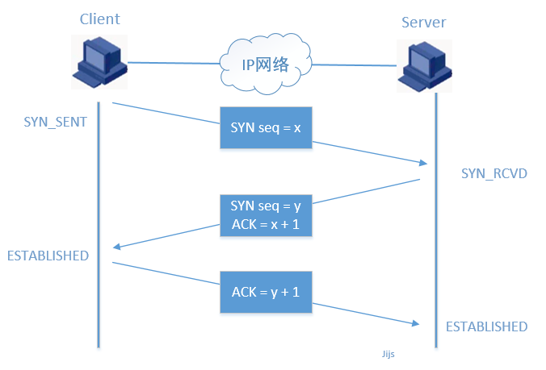
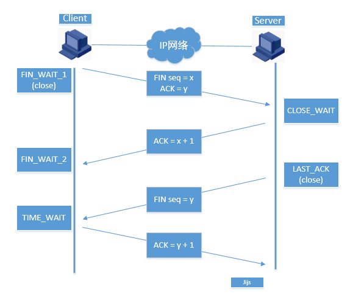

::: tip 概述
当遇到一些要死记的东西时会记在这边。
:::

## http
### 状态码
```js
const codeMessage = {
  200: '服务器成功返回请求的数据。',
  201: '新建或修改数据成功。',
  202: '一个请求已经进入后台排队（异步任务）。',
  204: '删除数据成功。',
  400: '发出的请求有错误，服务器没有进行新建或修改数据的操作。',
  401: '用户没有权限（令牌、用户名、密码错误）。',
  403: '用户得到授权，但是访问是被禁止的。',
  404: '发出的请求针对的是不存在的记录，服务器没有进行操作。',
  406: '请求的格式不可得。',
  410: '请求的资源被永久删除，且不会再得到的。',
  422: '当创建一个对象时，发生一个验证错误。',
  500: '服务器发生错误，请检查服务器。',
  502: '网关错误。',
  503: '服务不可用，服务器暂时过载或维护。',
  504: '网关超时。',
}
```
### http中的Cache-Control
::: tip
`Cache-Control`通用消息头字段被用于在http请求和相应中通过指定指令来实现缓存机制。缓存指令是单向的，这意味着在请求设置的指令，在相应中不一定包含相同的指令。
:::
有如属性：
`public`:表明响应可以被任何对象（包括：发送请求的客户端，代理服务器，等等）缓存。
`private`:表明响应只能被单个用户缓存，不能作为共享缓存（即代理服务器不能缓存它），可以缓存响应内容。
`no-cache`:在释放缓存副本之前，强制高速缓存请求提交给原始服务器进行验证
### 浏览器对于Cache-Control的响应
[https://blog.csdn.net/four_lemmo/article/details/78211520](https://blog.csdn.net/four_lemmo/article/details/78211520)
## placeholder样式的更改
```css
input::-webkit-input-placeholder, textarea::-webkit-input-placeholder { 
color: #666; 
} 
input:-moz-placeholder, textarea:-moz-placeholder { 
color: #666; 
} 
input::-moz-placeholder, textarea::-moz-placeholder { 
color: #666; 
} 
input:-ms-input-placeholder, textarea:-ms-input-placeholder { 
color: #666; 
}
```
## Http Options Method
::: tip Option Method
OPTIONS请求方法的主要用途有两个：
1、获取服务器支持的HTTP请求方法；
2、用来检查服务器的性能。
3、域请求，检测是否是跨域
:::

## MutationObserver
::: tip MutationObserver API
Mutation Observer API 用来监视 DOM 变动。DOM 的任何变动，比如节点的增减、属性的变动、文本内容的变动，这个 API 都可以得到通知
:::
[api地址](https://wangdoc.com/javascript/dom/mutationobserver.html)

## npm
### 查看本地（该仓库）安装了哪些包
`npm list --depth=0`
### 查看全局（-g）安装了哪些包
`npm list --depth=0 --global`
### 安装包
`npm install xxx`
安装`xxx`模块到当前命令行所在的目录
`npm install -g xxx`
利用npm安装全局模块xxx
### 本地安装
::: tip
本地安装时将模块写入package.json中，方便别人install
:::
`npm install xxx`<br>
安装但不写入package.json
`npm install xxx --save`<br>
安装并写入package.json的`dependencies`中
`npm install xxx --save-dev`<br>
安装并写入package.json的`devDependencies`中
### dependencies & devDependencies
`devDependencies`是只会在开发环境下依赖的模块，生产环境不会被打入包内<br>
`dependencies`依赖的包不仅开发环境能使用，生产环境也能使用
### 删除包
::: tip
删除本地模块时你应该思考的问题：是否将在package.json上的相应依赖信息也消除？
:::
`npm uninstall xxx`<br>
删除模块，但不删除模块留在package.json中的对应信息
`npm uninstall xxx --save`<br>
删除模块，同时删除模块留在package.json中dependencies下的对应信息
`npm uninstall xxx --save-dev`<br>
删除模块，同时删除模块留在package.json中devDependencies下的对应信息
## JS模块化
### CommonJS
::: tip
同步模块加载，不适合网络请求
:::
新建say.js
```js
exports.blog = {
  say: function(){
    return 'say function'
  }
}
```
新建test.js
```js
let say = require('./one').blog
console.log(say.say()) // say function'
```
### AMD
::: tip
Asynchronous Module Definition(异步组件定义)，提前加载依赖
:::
### CMD
::: tip
Common Module Definition，AMD的优化版，依赖后置，使用时才加载，
RequireJS提供延迟加载功能
:::
## eslint
### .eslintrc
`rules`
```js
  {
    // 关闭 禁止使用console，生产环境不能使用console
    'no-console': 'off',
    // 关闭 使用debugger，生产环境不能使用
    'no-debugger': 'off',
    // 关闭 禁止对函数参数再赋值，在使用map时会使用参数更改
    'no-param-reassign': 'off',
    // 关闭 强制 generator 函数中 * 号周围有空格
    'generator-star-spacing': 'off',
    // 强制缩进2格
    indent: ['error', 2],
    // 关闭 禁用不必要的转义字符
    'no-useless-escape': 'off',
    // 关闭 使用eval
    'no-eval': 'off',
    // 关闭 禁用未声明的变量
    'no-undef': 'off',
    // 开启 禁止使用拖尾逗号
    'comma-dangle': ['error', 'never'],
    // 关闭函数名()的前面加空格
    'space-before-function-paren': 'off',
    // 关闭代码末尾空行
    'no-trailing-spaces': 'off',
    // 禁止块内填充(不加多的空行)
    'padded-blocks': ['error', 'never'],
    // 不允许空行
    'no-empty': 'error',
    // 禁用封号
    semi: ['error', 'never'],
    // 允许全局属性的使用，比如isNaN()
    'no-restricted-globals': ['error', 'event'],
    // 允许函数根据代码分支有不同的return行为,可以return,也可以return false
    'consistent-return': 'off',
    // 关闭对function是否命名的禁用
    'func-names': 'off',
    // 关闭对continue的禁用
    'no-continue': 'off',
    // 关闭在数组里面必须return
    'array-callback-return': 'off',
    // 关闭禁止使用特定的语法
    'no-restricted-syntax': 'off',
    'vue/require-default-prop': 'warning',
    'vue/no-v-html': 'warning',
    'vue/no-use-v-if-with-v-for': 'off'
  }
```

## C# => 取num个在min - max的不重复随机数
```c#
/// 
    /// </summary>
    /// <param name="num"></param>
    /// <param name="min"></param>
    /// <param name="max"></param>
    /// <returns></returns>
    public static List<int> getRandomNumBetweenMinAndMax(int num, int min, int max)
    {
        List<int> result = new List<int>();
        bool flag;
        for (int i = 0; i < num;)
        {
            flag = true;
            System.Random ran = new System.Random();
            int n = ran.Next(min, max);
            foreach (int r in result)
            {
                if (r == n)
                {
                    flag = false;
                    break;
                }
            }
            if (flag)
            {
                result.Add(n);
                i++;
            }
        }
        return result;
    }
```
## js复制黏贴增加内容
```js
document.body.oncopy = function (e) {
		let text = getSelection() + "你要增加的内容"
		//clipboardData：剪贴板
		e.clipboardData.setData("text", text)
		e.preventDefault()
	}
```
## TCP/IP
::: tip
OSI七层模型对应过来TCP只有四层。
:::
| OSI七层模型       | 应用       | TCP/IP四层模型 |      应用      |
| -------------| --------------- | ------------- |:-------------:|
| 应用层、表示层、会话层| 表示层：ASCII         | 应用层         | http协议、FTP协议 |
| 传输层        | 防火墙         | 传输层         | tcp、udp      |
| 网络层        | 三层交换机         | 网络层         | 路由器      |
| 数据链路、物理层| 二层交换机和网卡、集线器         | 链路接口层      |      |
::: tip 二层交换机&三层交换机
二层交换机只有交换功能，而三层交换机因为是在第三层，所以具有交换功能和路由器的功能。
:::
* 物理层:负责在物理线路上传输原始额二进制数据；
* 数据链路层：负责在通信的实体间建立数据链路连接；
* 网络层：负责创建逻辑链路，以及实现数据包的分片和和重组，实现拥塞控制、网络互动等功能；
* 传输层：负责向用户提供端到端的通讯服务，实现流量控制以及差错控制；
* 会话层：定义何时开始、控制和结束一个会话，包括对多个双向消息的控制和管理，以便只完成连续消息的一部分可以通知应用，从而使得表示层看到的数据是连续的，某些情况下，如果表示层收到了所有的数据，则用数据代表表示层；
* 表示层：定义数据格式以及加密
* 应用层：为应用程序提供了网络服务

### TCP/IP协议
::: tip 概念
TCP/IP是一个协议簇，里面包括很多协议，例如：超文本协议(http)，文件传输协议(ftp)，TCP（Transmission Control Protocol 传输控制协议），UDP（User Datagram Protocol 用户数据报协议（无连接））
:::
### TCP&UDP
区别：
1. 基于连接与无连接
2. 对系统资源的要求（TCP较多，UDP少）
3. UDP程序结构简单
4. TCP流模式与UDP数据报模式
### 三次握手

### 四次挥手
::: tip 注意
没有client端和服务端之分，只有主动方与被动方，因为断开连接也可以是server端主动断开，但是连接肯定是client主动发送的。
:::

### https
::: tip https
HTTPS即加密的HTTP，HTTPS并不是一个新协议，而是HTTP+SSL（TLS）。原本HTTP先和TCP（假定传输层是TCP协议）直接通信，而加了SSL后，就变成HTTP先和SSL通信，再由SSL和TCP通信，相当于SSL被嵌在了HTTP和TCP之间
:::  
### http1.0&&http1.1&&http2.0

## DNS
它作为将域名与IP地址相互映射的一个分布式数据库，能够使人更方便地访问互联网。DNS使用TCP和UDP端口53
## get&&post
get也可以带body参数，
## 排序
### 归并排序
```js
//归并排序
function mergeSort(arr) {
    const merge = (arr, l, mid, r) => {
      let help = []
      let i = 0
      let p1 = l
      let p2 = mid + 1
      while (p1 <= mid && p2 <= r) {
        help[i++] = (arr[p1] < arr[p2]) ? arr[p1++] : arr[p2++]
      }
      while (p1 <= mid) {
        help[i++] = arr[p1++]
      }
      while (p2 <= r) {
        help[i++] = arr[p2++]
      }
      console.log('help', help)
      for (let i = 0; i < help.length; i++) {
        arr[l + i] = help[i]
      }
      console.log('arr', arr)
    }
  const sortProcess = (arr, l, r) => {
    if (l == r) {
      return
    }
    let mid = Math.floor((l + r) / 2)
    sortProcess(arr, l, mid)
    sortProcess(arr, mid + 1, r)
    merge(arr, l, mid, r)
  }

    if (arr.length < 2) {
      return
    }
    sortProcess(arr, 0, arr.length - 1)
}
mergeSort(test)
```
打印
```
help [ 2, 4 ]
arr [ 2, 4, 52, 3, 2, 56, 23, 1 ]
help [ 3, 52 ]
arr [ 2, 4, 3, 52, 2, 56, 23, 1 ]
help [ 2, 3, 4, 52 ]
arr [ 2, 3, 4, 52, 2, 56, 23, 1 ]
help [ 2, 56 ]
arr [ 2, 3, 4, 52, 2, 56, 23, 1 ]
help [ 1, 23 ]
arr [ 2, 3, 4, 52, 2, 56, 1, 23 ]
help [ 1, 2, 23, 56 ]
arr [ 2, 3, 4, 52, 1, 2, 23, 56 ]
help [ 1, 2, 2, 3, 4, 23, 52, 56 ]
arr [ 1, 2, 2, 3, 4, 23, 52, 56 ]
```
## 后端返回流下载
::: tip 
正常情况下window.open可以解决下载问题，但是有时候要在请求头里面加参数，比如一些权限验证，就可以用下面的代码
:::
```js
const download = async (url, sessionId) => {
  const fileResponse = await axios.get(url, { headers: { authorization:  'token...'} })
  const blob = new Blob([fileResponse.data], { type: 'text/plain;charset=utf-8' })
  url = window.URL.createObjectURL(blob)
  const a = document.createElement('a')
  a.href = url
  a.download = ['fileName']
  a.click()
  window.URL.revokeObjectURL(url)
}
```
